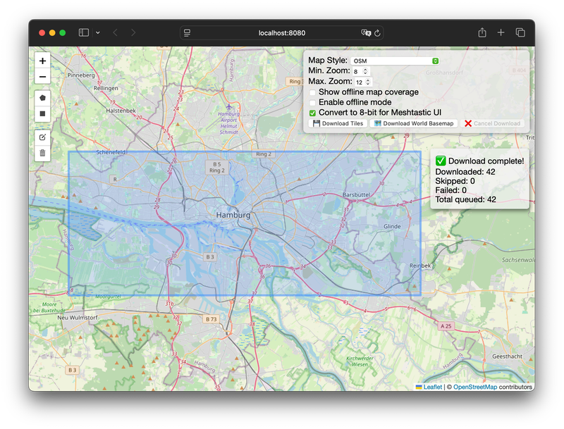
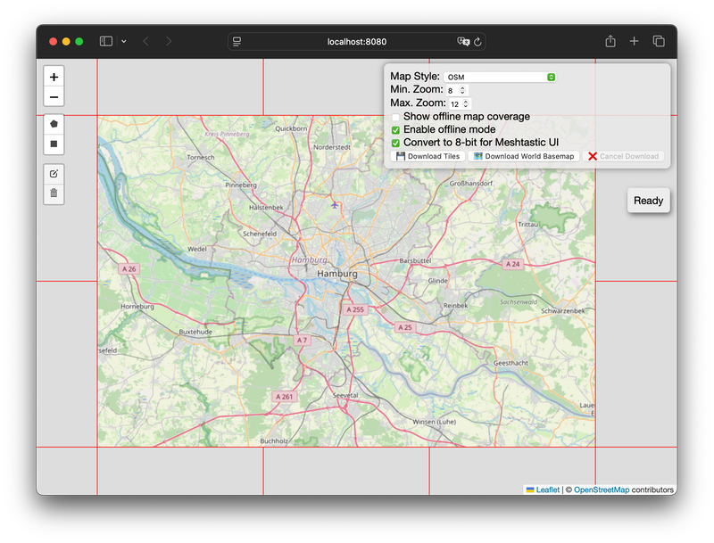

# Offline Map Tile Downloader

[](#readme)
[](#readme)
[](#readme)
[](#readme)
[](#readme)

**Create your own offline maps for any location on Earth!** This tool allows you to download map tiles from various sources and use them in your offline applications, with a special focus on the needs of the **Off-Grid**, **Meshtastic** and **MeshCore** communities.

| Download | Offline Mode |
|----------|--------------|
|  |  |

Whether you're a hiker, prepper, sailor, or just someone who wants to be prepared, having access to maps when you're disconnected from the internet is crucial. This tool makes it easy to create your own custom map sets for your specific needs.

## Why?

In a world that's increasingly reliant on internet connectivity, being able to access information offline is a superpower. This is especially true for:

*   **The Off-Grid Community:** When you're living off the grid, you can't rely on a stable internet connection. This tool allows you to have detailed maps of your surroundings, which is essential for navigation, resource management, and safety.
*   **The Meshtastic and MeshCore Community:** This tool allows you to create custom map tiles that can be used with the Meshtastic UI or MeshCore Ripple Firmware, giving you a visual representation of your mesh network on a map, even when you're completely offline.

## Features

*   **Web Interface:** A user-friendly web UI for selecting download areas and monitoring progress.
*   **Polygon & Bounding Box Selection:** Define download areas using polygons or bounding boxes.
*   **Concurrent Downloads:** Downloads multiple tiles concurrently for faster performance.
*   **Rate Limiting:** Limits the number of tile downloads per second to avoid overloading the tile server.
*   **Cancellable Downloads:** Cancel ongoing downloads at any time.
*   **8-bit PNG Conversion:** Option to convert downloaded tiles to 8-bit PNGs, ideal for devices with limited color palettes like the Meshtastic UI and Ripple Firmware.
*   **Offline Tile Server:** Serve downloaded tiles directly from the application, allowing you to use them in offline map applications.
*   **Cross-platform:** Works on Windows, macOS, and Linux.

## Getting Started

You can either download a pre-built binary for your operating system or build the application from source.

### Pre-built Binaries (Recommended for most users)

This project require you to use a command-line interface.
Don't worry, it's easier than it looks!

####  Windows (PowerShell)

1. [Download](https://github.com/Cyclenerd/offline-map-tile-downloader/releases/latest) the `offline-map-tile-downloader.exe` application for Windows and your CPU architecture. If you are unsure, usually `x86_64` will work.
    * [x86_64](https://github.com/Cyclenerd/offline-map-tile-downloader/releases/latest/download/offline-map-tile-downloader-windows-x86_64.exe) Intel or AMD 64-Bit CPU
    * [arm64](https://github.com/Cyclenerd/offline-map-tile-downloader/releases/latest/download/offline-map-tile-downloader-windows-arm64.exe) Arm-based 64-Bit CPU
1. Rename it to: `offline-map-tile-downloader.exe`
1. Press the <kbd>Windows key</kbd> + <kbd>X</kbd>.
1. Choose "Windows PowerShell".
1. Type `cd` followed by the path to your your folder where you saved the application (e.g., `cd C:\Users\YourName\Documents\OfflineMaps`) and press Enter.
1. Type `offline-map-tile-downloader.exe` and press Enter.
1. Open your web browser and go to [`http://localhost:8080`](http://localhost:8080).

###  macOS (Terminal)

1. [Download](https://github.com/Cyclenerd/offline-map-tile-downloader/releases/latest) the `offline-map-tile-downloader` application for macOS and your CPU architecture.
    * [x86_64](https://github.com/Cyclenerd/offline-map-tile-downloader/releases/latest/download/offline-map-tile-downloader-macos-x86_64) Intel 64-bit CPU
    * [arm64](https://github.com/Cyclenerd/offline-map-tile-downloader/releases/latest/download/offline-map-tile-downloader-macos-arm64) Apple silicon 64-bit CPU (M1, M2...)
1. Rename it to: `offline-map-tile-downloader`
1. Press <kbd>Command</kbd> + <kbd>Space</kbd>.
1. Type "Terminal" and press Enter.
1. Type `cd` followed by the path to your folder where you saved the application (e.g., `cd /Users/YourName/Documents/OfflineMaps`) and press Enter.
1. Type `chmod +x offline-map-tile-downloader` and press Enter. (This makes the tool work).
1. Type `./offline-map-tile-downloader` and press Enter.
1. (Optional) Allow unsigned app on macOS
    1. Go to System Settings
    1. Click on Privacy & Security
    1. Scroll down to Security section
    1. Look for a message about the blocked `offline-map-tile-downloader` app and click "Open Anyway"
1. Open your web browser and go to [`http://localhost:8080`](http://localhost:8080).


###  Linux (Terminal)

1. [Download](https://github.com/Cyclenerd/offline-map-tile-downloader/releases/latest) the `offline-map-tile-downloader` application for Linux and your CPU architecture.
    * [x86_64](https://github.com/Cyclenerd/offline-map-tile-downloader/releases/latest/download/offline-map-tile-downloader-linux-x86_64) Intel or AMD 64-Bit CPU
    * [arm64](https://github.com/Cyclenerd/offline-map-tile-downloader/releases/latest/download/offline-map-tile-downloader-linux-arm64) Arm-based 64-Bit CPU (i.e. Raspberry Pi)
1. Rename it to: `offline-map-tile-downloader`
1. Open a Terminal.
1. Type `cd` followed by the path to your your folder where you saved the application (e.g., `cd /home/YourName/OfflineMaps`) and press Enter.
1. Type `chmod +x offline-map-tile-downloader` and press Enter. (This makes the tool work).
1. Type `./offline-map-tile-downloader` and press Enter.
1. Open your web browser and go to [`http://localhost:8080`](http://localhost:8080).


### Building from Source

If you're a developer or want to modify the code, you can build the application from source.

1.  **Clone the repository:**
    ```bash
    git clone https://github.com/Cyclenerd/offline-map-tile-downloader.git
    cd offline-map-tile-downloader
    ```
2.  **Build the application:**
    ```bash
    go build .
    ```
3.  **Run the application:**
    ```bash
    ./offline-map-tile-downloader
    ```
4.  **Open your web browser** and go to `http://localhost:8080`.


## File Storage

The downloaded map tiles are stored in the local filesystem. The default directory is `maps`, but you can change this using the `-maps-directory` command-line option. The tiles are organized by map style, zoom level, and tile coordinates.

## Command-line Options

You can also use command-line options to configure the application:

*   `-port`: The port number for the server (default: `8080`).
*   `-maps-directory`: The directory for cached map tiles (default: `maps`).
*   `-max-workers`: The number of concurrent download workers (default: `10`).
*   `-rate-limit`: The maximum number of tiles to download per second (default: `50`).
*   `-max-retries`: The maximum number of retries for downloading a tile (default: `3`).
*   `-help`: Show the help message.

Example:

```bash
./offline-map-tile-downloader -port 8081 -maps-directory my-tile-cache -max-workers 5 -rate-limit 25
```

## Meshtastic UI Integration

This tool is perfect for creating offline maps for the Meshtastic UI. Here's how to do it:

1.  **Download the tiles:**
    *   Select the area you want to download.
    *   **Crucially, check the "Convert to 8-bit" checkbox.** This is required for Meshtastic.
    *   Click "Download Tiles".

2.  **Use with Meshtastic:**
    *   The downloaded tiles are stored in the `maps` directory. You can now use these tiles with the Meshtastic UI. For more information on how to do this, please refer to the [Meshtastic documentation](https://meshtastic.org/docs/software/meshtastic-ui/#map).

## MeshCore Ripple Firmware Integration

This tool is perfect for creating offline maps for the Ripple Firmware. Here's how to do it:

1.  **Download the tiles:**
    *   Select the area you want to download.
    *   **Check the "Convert to 8-bit" checkbox.** This is recommended for the Ripple firmware to save storage space.
    *   Click "Download Tiles".

2.  **Use with Ripple Firmware:**
    *   The downloaded tiles are stored in the `maps` directory. You can now use these tiles with the Ripple firmware. Copy the subfolder named after the selected map style to an SD card and rename it `tiles`. For more information on how to do this, please refer to the [MeshRipple Firmwaretastic documentation](https://buymeacoffee.com/ripplebiz/ultra-v7-7-guide-meshcore-users).

## Configuration

You can add your own map sources by editing the [`config/map_sources.json`](./config/map_sources.json) file. The format is simple:

```json
{
  "Map Source Name": "https://tile.server.url/{z}/{x}/{y}.png",
  "Another Map Source": "https://another.tile.server/{z}/{x}/{y}.png"
}
```

To activate the change, you must recompile the application.

## Contributing

If you have an idea for a new feature or have found a bug, please open an issue or submit a pull request.

## License

This project is licensed under the MIT License. See the `LICENSE` file for details.

The emoji graphics are from the open source project [Twemoji](https://twemoji.twitter.com/). The graphics are copyright 2020 Twitter, Inc and other contributors. The graphics are licensed under [CC-BY 4.0](https://creativecommons.org/licenses/by/4.0/). You should review the license before usage in your project.

Leaflet is licensed under the BSD 2-Clause "Simplified" License. See the [https://github.com/Leaflet/Leaflet/blob/main/LICENSE](https://github.com/Leaflet/Leaflet/blob/main/LICENSE) file for details.

## Acknowledgements

*   **[Leaflet](https://github.com/Leaflet/Leaflet):** For the interactive map interface.
*   **[Gorilla WebSocket](https://github.com/gorilla/websocket):** For real-time communication.
*   **[mattdrum](https://github.com/mattdrum/map-tile-downloader):** For the original idea and a Python implementation.
*   **[Google Gemini CLI](https://github.com/google-gemini/gemini-cli):** For providing invaluable assistance with code generation, debugging, and project documentation.